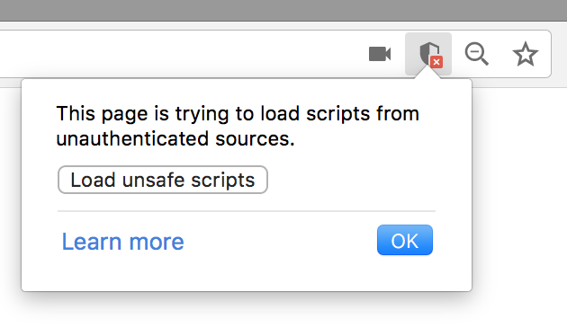

# Hue Voice
#### Voice control for Philips Hue in the Web Browser

This [repository](https://github.com/fsyth/hue-voice) contains a class, Hue, that interfaces with Philips Hue lights from a web browser.

It also contains a class, HueCommand, that translates voice commands into state objects for use with Hue.

This allows Philips Hue lights to be controlled by voice, using the native Web Speech API. This API is very new, so currently only works in recent versions of Google Chrome. You will need to allow access to your microphone when prompted.

See the [documentation](https://fsyth.github.io/hue-voice/docs/) for help with using either of these classes.

A basic example webpage that voice controls Hue has been provided. Serve the `src` folder on your local network over HTTP to test it.

The project is also hosted through [GitHub Pages here](https://fsyth.github.io/hue-voice/src/), but you will need to allow Mixed Content for it to work (see issue below).

### Current Issues
##### The Hue class will only work when served over HTTP
- This is because the Hue Bridge itself acts like a web server on your local network and does not accept HTTPS requests.
- When trying to request content over HTTP from a website served over HTTPS, a Mixed Content security error occurs.
- The project is available through [GitHub Pages here](https://fsyth.github.io/hue-voice/src/), but this service only allows serving over HTTPS.
- You can temporarily allow Mixed Content on a page by clicking this button on your browser bar:
  - 
  - This should be perfectly safe, since only the Hue Bridge on your local network is requested over HTTP, nothing else.
  - Not much that can be done about the warning message.

##### Browsers
- The Web Speech API is an experimental technology. You can check [browser compatibility here](https://developer.mozilla.org/en-US/docs/Web/API/Web_Speech_API#Browser_compatibility).
- Just use Chrome or Firefox, and update your browser if nothing works.

### Updating the documentation

Documentation is automatically generated from specially marked up comments in the sourcecode using JSDoc.

`npm install -g jsdoc`

Run JSDoc for all files in the source folder.

`jsdoc ./src -d ./docs --verbose`
